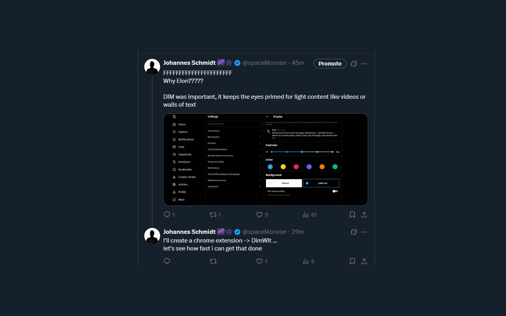

# DimWit (Firefox)

Firefox extension that brings back X's Dim dark mode (#15202B) by replacing the Lights Out pure black theme.

## Install from Firefox Add-ons

The extension is currently in review. The AMO link will be posted here once it's approved.

## Install manually

1. Clone or download this repo
2. Open `about:debugging#/runtime/this-firefox`
3. Click **Load Temporary Add-on**
4. Select `src/manifest.json`

## How it works

DimWit uses CSS overrides and a lightweight MutationObserver to replace Lights Out colors with their Dim equivalents:

| Lights Out | Dim | Usage |
|---|---|---|
| `#000000` | `#15202B` | Main background |
| `#16181C` | `#1A2734` | Elevated surfaces |
| `#1D1F23` | `#1E2D3D` | Hover states |
| `#2F3336` | `#38444D` | Borders/dividers |
| `#202327` | `#253341` | Input fields |

CSS handles static styles, the MutationObserver catches dynamically injected inline styles as X loads content.

## Firefox Add-ons publishing

The GitHub Actions workflow (`.github/workflows/publish.yml`) publishes automatically when you push a `v*` tag.

Required GitHub secrets:

| Secret | Source |
|---|---|
| `WEB_EXT_API_KEY` | AMO → Developer Hub → Manage API Keys |
| `WEB_EXT_API_SECRET` | AMO → Developer Hub → Manage API Keys |

## License

MIT
